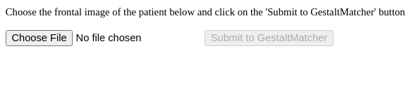

.. Visualiser documentation master file, created by
   sphinx-quickstart on Fri Feb 23 15:53:48 2024.
   You can adapt this file completely to your liking, but it should at least
   contain the root `toctree` directive.

Welcome to Visualiser's documentation!
============================================

This is a visualiser application for handling QC plots for HGQN application.

    This figure shows the landing page of Visualiser application.

.. raw:: latex

    \part{Installation}

.. toctree::
    :maxdepth: 1
    :caption: Installation
    :name: installation
    :hidden:
    :titlesonly:

    pre_requisites
    install_requirements
    app_startup

.. raw:: latex

    \part{Docker}

.. toctree::
    :maxdepth: 1
    :caption: Docker
    :name: docker
    :hidden:
    :titlesonly:

    docker_setup

.. raw:: latex

    \part{Usage}

.. toctree::
    :maxdepth: 1
    :caption: Usage
    :name: usage
    :hidden:
    :titlesonly:

    app_usage

.. raw:: latex

    \part{References}

.. toctree::
    :maxdepth: 1
    :caption: References
    :name: references
    :hidden:
    :titlesonly:

    references

